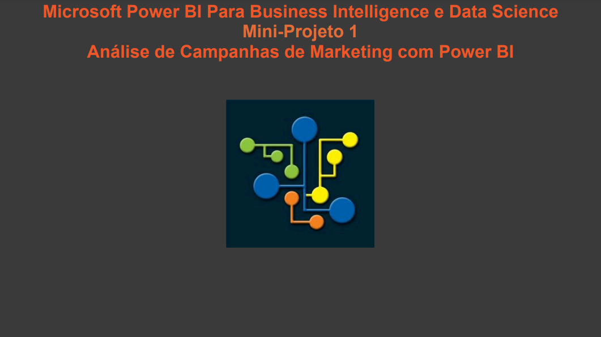
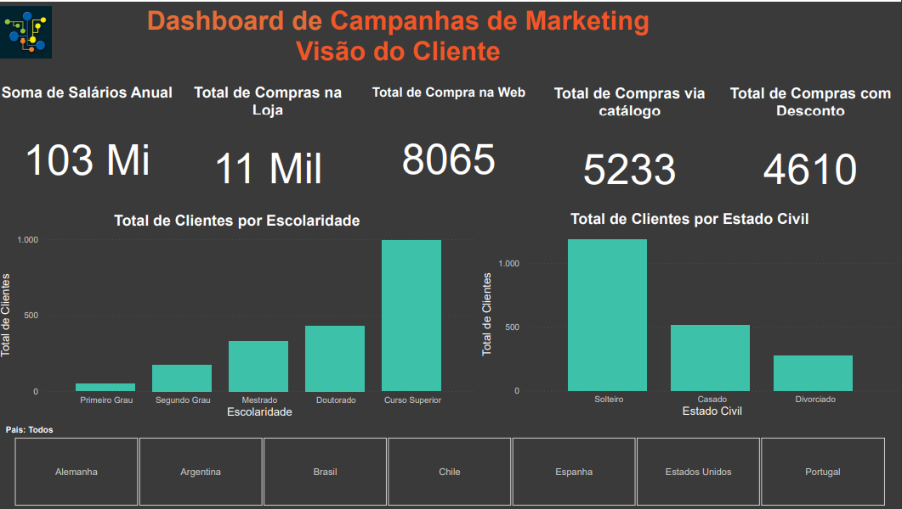
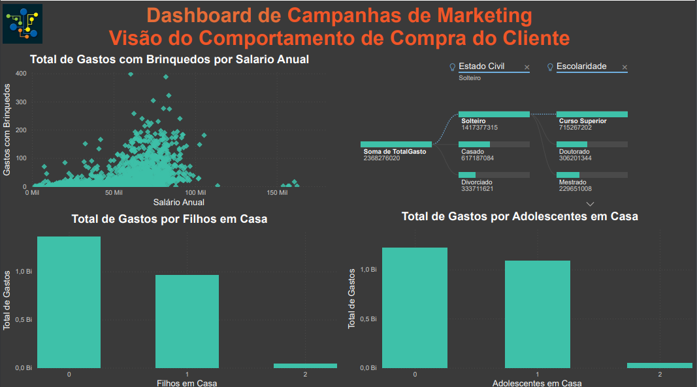
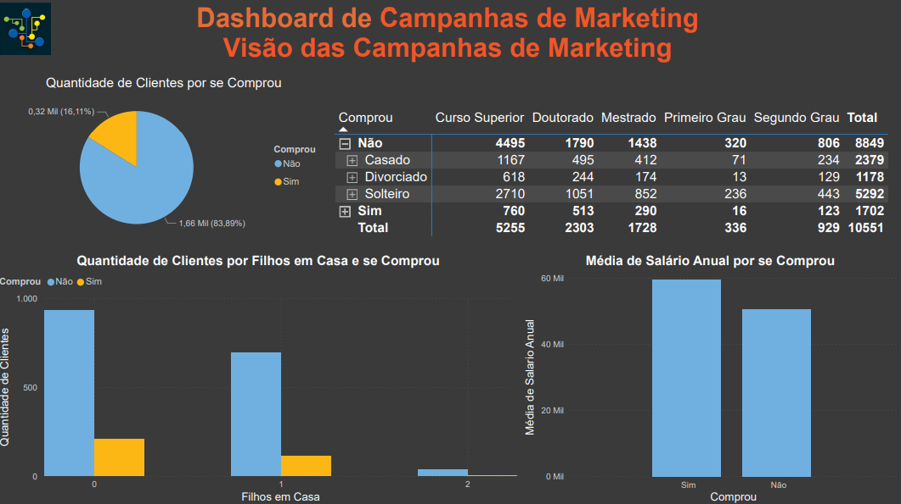
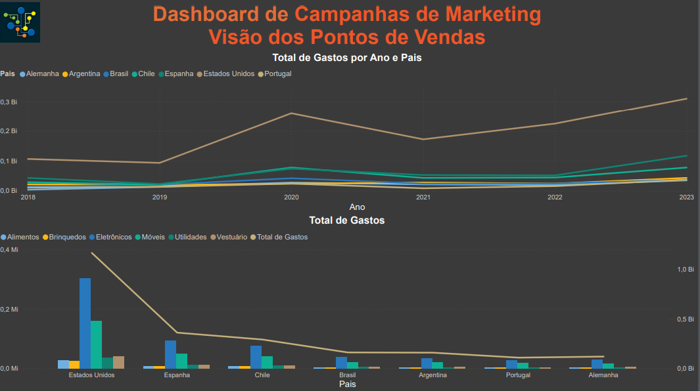

# Mini-Projeto 1 - Análise de Campanhas de Marketing com Power BI

Atividade prática do Capítulo 4 do curso Microsoft Power BI Para Business Intelligence e Data Science 3.0 da Data Science Academy.

## 1 - Visão do Cliente

##  2 - Visão do Comportamento de Compra do Cliente
    

## 3 - Visão das Campanhas de Marketing
    

## 4 - Visão dos Pontos de Vendas
    

## 5 - Visão das Campanhas de Marketing (2)
    

