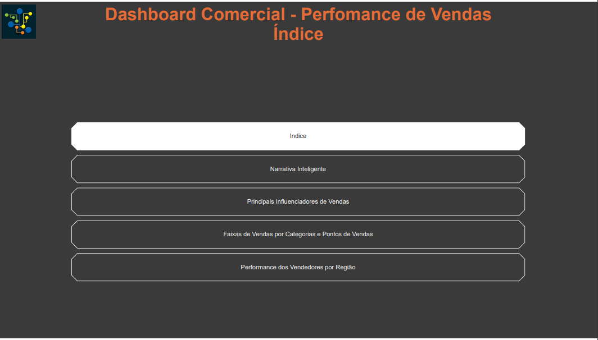
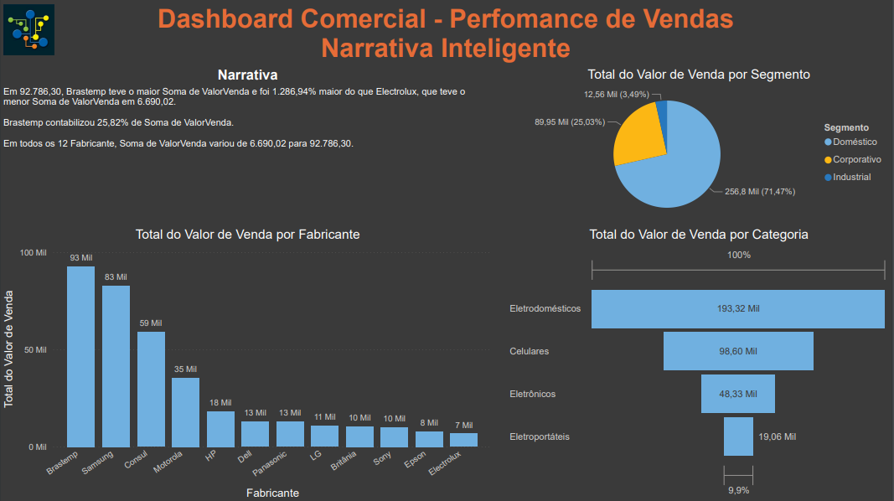
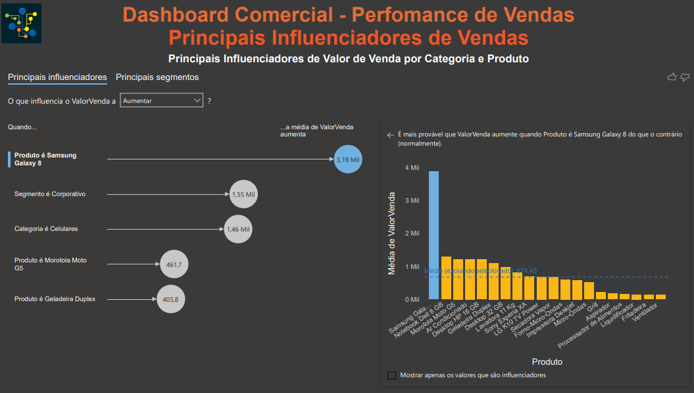
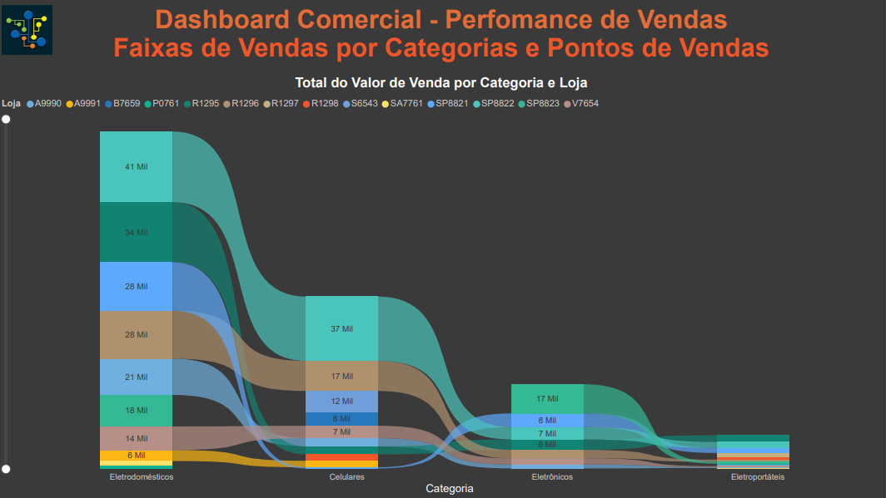
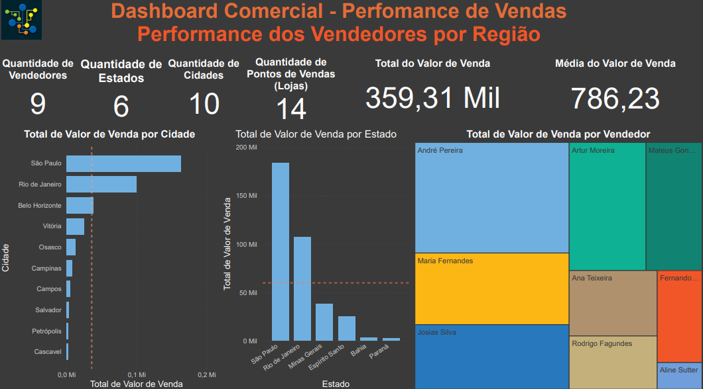

# Mini-Projeto 2 - Dashboard Comercial - Perfomance de Vendas

Atividade prática do Capítulo 5 do curso Microsoft Power BI Para Business Intelligence e Data Science 3.0 da Data Science Academy.

## Índice de Dashboards

## Dashboard 1 - Narrativa Inteligente

## Dashboard 2 - Principais Influenciadores de Vendas

## Dashboard 3 - Faixas de Vendas por Categorias e Pontos de Vendas

## Dashboard 4 - Performance dos Vendedores por Região

