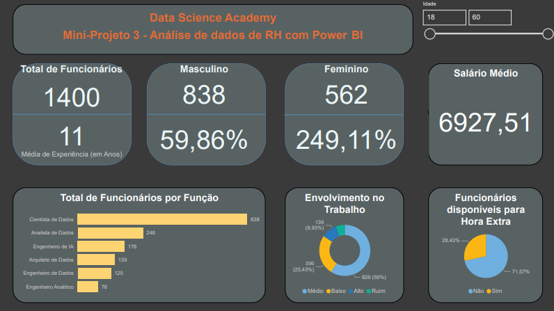
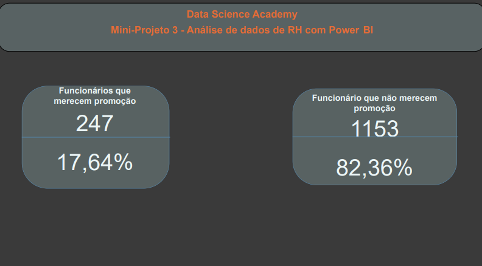

# Mini-Projeto 3 - Análise de dados de RH com Power BI

Atividade prática do Capítulo 6 do curso Microsoft Power BI Para Business Intelligence e Data Science 3.0 da Data Science Academy.

## Dashboard RH

## Promoção e não promoção

## Perguntas e Respostas

1.  Qual o total de funcionários atualmente na empresa?  

 **R:1400**
    
2.  Qual o tempo médio de experiência dos funcionários (em anos)?  

**R:11.**
    
3.  Qual o total e percentual de funcionários do gênero masculino e feminino?  

**R:Masculino: 838 e 59,86 %; Feminino: 562 e 40,41%.**
    
4.  Qual a média salarial mensal?  

**R: 6.927,51.**
    
5.  Qual o total de funcionários por função?  

 **R:638 Cientistas de Dados, 246 Analistas de Dados, 176 Engenheiros de IA, 139 Arquitetos de Dados, 125 Engenheiros de Dados, 76 Engenheiros Analíticos.**
    
6.  Qual o percentual de funcionários disponíveis para fazer hora extra?  

**R:28,43%**
    
7.  Qual o nível de envolvimento dos funcionários no trabalho considerando 4 categorias: Ruim, Baixo, Médio e Alto? 

**R:79 (5,64%) para Ruim, 356 (25,43%) para Baixo, 826 (59%) para Médio, 139 (9,93 %) para Alto.** 
    
